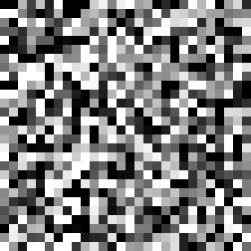
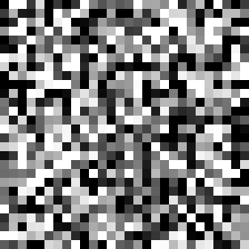
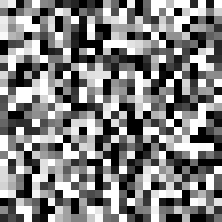
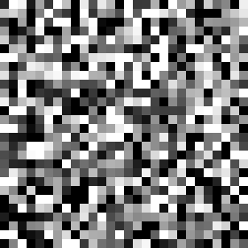
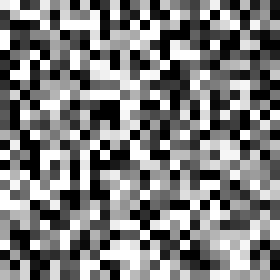
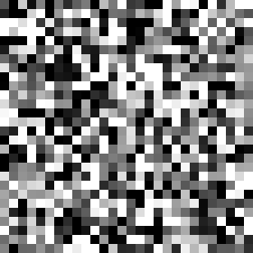
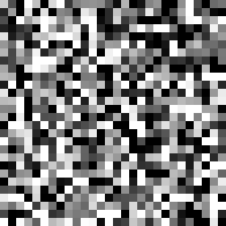
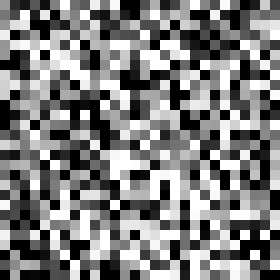
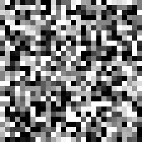
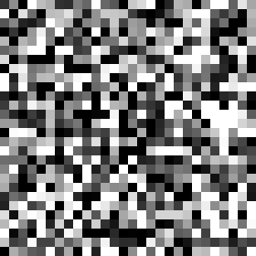

# Conditional MNIST Diffusion: Class-Guided Image Synthesis

[](https://www.python.org/)
[](https://pytorch.org/)
[](https://matplotlib.org/)
[](https://opensource.org/licenses/MIT)

An implementation of a Conditonal Denoising Diffusion Probabilistic Model (DDPM) trained on the MNIST dataset. Refactored from a basic unconditional generative 
featuring a heavily customized Conditional U-Net with fused temporal-class embeddings and multi-head self-attention. 

---

## Key Highlights & Architectural Improvements

* **Conditional U-Net Backbone:** Replaces standard unconditional noise prediction with a strict class-aware architecture. The network perfectly balances global structural generation with targeted stylistic adherence to user-provided class labels (0-9).
* **Fused Embeddings Pipeline:** Integrates continuous Sinusoidal Positional Embeddings (for diffusion timesteps) with discrete PyTorch `nn.Embedding` vectors (for digit classes), merging them additively before injecting them deep into every residual block.
* **Global Self-Attention Bottleneck:** Upgrades the standard fully-convolutional U-Net by embedding Multi-Head Self-Attention at the lowest resolution bottleneck. This guarantees the network learns global spatial dependencies (e.g., smoothly connecting the top and bottom loops of an '8') rather than relying solely on local 3x3 pixel receptive fields.
* **SiLU (Swish) Activations:** Transitions from standard ReLUs to SiLU activations across all convolutional layers, preventing dead gradients when predicting the negative, continuous values inherent to Gaussian noise distributions.
---

The model progressively denoises random static over 1,000 timesteps to form the requested digit.

| Digit 0 | Digit 1 | Digit 2 | Digit 3 | Digit 4 |
| :---: | :---: | :---: | :---: | :---: |
|  |  |  |  |  |
| **Digit 5** | **Digit 6** | **Digit 7** | **Digit 8** | **Digit 9** |
|  |  |  |  |  |

---

## System Architecture: The Conditional U-Net

The core of this system is the Conditional U-Net, designed to map heavily corrupted Gaussian noise back to clean data distributions while being strictly conditioned on two external signals: the current timestep and the desired integer label.

### 1. Signal Conditioning & Injection
Unlike standard networks where inputs simply flow top-to-bottom, this U-Net continuously injects temporal and class awareness at every depth level:
* **Timestep (t):** Mapped into a high-dimensional continuous geometric space using Transformer-style Sinusoidal Positional Embeddings.
* **Class Label (c):** Mapped via a learned lookup table (`nn.Embedding(10, dim)`).
* **Fusion:** Both vectors are summed together and passed through a Multi-Layer Perceptron (MLP). This combined signal is then broadcast and added to the feature maps inside every single Down and Up block, constantly reminding the convolutions of *when* they are and *what* they are drawing.

### 2. Encoder-Decoder Spatial Flow
* **Encoder (Downsampling):** Progressively doubles the channel depth while halving the spatial resolution using Max Pooling. Each level utilizes two consecutive Convolutional Blocks (Conv2d -> BatchNorm -> SiLU -> Injection) to deeply process structural features before compression.
* **Attention Bottleneck:** At the maximum depth (128-channel minimum resolution), the flattened feature maps pass through a Multi-Head Self-Attention layer. This allows the model to correlate distant pixel patches simultaneously before the upsampling process begins.
* **Decoder (Upsampling):** Restores spatial resolution via `ConvTranspose2d`. Crucially, it concatenates skipped residual connections directly from the Encoder to recover the fine-grained, high-frequency details lost during the pooling phases.

---

## Project Structure

```text
PLEASE NOTE that the non _cond files are the original UNet without condition.
They work however they created random numbers.

mnist-diffusion/
├── checkpoints/          # Serialized PyTorch weight files (*.pth) WEIGHTS HAVE NOT BEEN UPLOADED
├── dataset.py            # MNIST DataLoader and transforms
├── diffusion.py          # Forward noise schedule (alpha, beta variances)
├── model_cond.py         # Conditional U-Net, Attention, & ConvBlocks
├── utils.py              # Matplotlib visualization and GIF generation helpers
├── train_cond.py         # Training CLI driver script
├── sample_cond.py        # Interactive evaluation and sampling CLI
├── requirements.txt      # Fixed Python package dependencies
└── README.md             # System documentation
```
---

## Quickstart & Installation

### 1. Prerequisites
Ensure you have Python 3.10+ installed along with PyTorch configured for your hardware (CUDA strongly recommended).

### 2. Environment Setup
```bash
# Clone repository
git clone [https://github.com/yourusername/mnist-diffusion.git](https://github.com/yourusername/mnist-diffusion.git)
cd mnist-diffusion

# Create and activate virtual environment
python -m venv venv
source venv/bin/activate  # On Windows: venv\Scripts\activate

# Install dependencies
pip install -r requirements.txt
```

---

## Usage Guide

### Model Training
Train the conditional U-Net from scratch. The script monitors validation loss and automatically checkpoints the best model weights.
```bash
python train_cond.py --epochs 50 --batch_size 128 --lr 0.0002 --timesteps 1000
```

### Interactive Generation (Sampling)
Launch the interactive prompt to generate specific digits on command and watch the reverse diffusion process.
```bash
# Generate and display final image natively in Matplotlib GUI
python sample_cond.py -d

# Generate, display, and automatically export the denoising process as a GIF
python sample_cond.py -d -g
```

### CLI Configuration Flags

| Command Script | Flag | Type | Default | Description |
| :--- | :--- | :--- | :--- | :--- |
| `train_cond.py` | `--epochs` | `int` | `50` | Total training epochs |
| `train_cond.py` | `--batch_size` | `int` | `128` | Dataloader batch size |
| `train_cond.py` | `--lr` | `float` | `0.0002` | Learning rate for Adam optimizer |
| `train_cond.py` | `--timesteps` | `int` | `1000` | Total diffusion steps (T) |
| `train_cond.py` | `--save_dir` | `str` | `./checkpoints` | Checkpoint output directory |
| `sample_cond.py` | `--display` | `flag` | `False` | Opens Matplotlib GUI for final image |
| `sample_cond.py` | `--gif` | `flag` | `False` | Exports generation sequence to ./readme |

---

## License

Distributed under the MIT License. See `LICENSE` for more information.